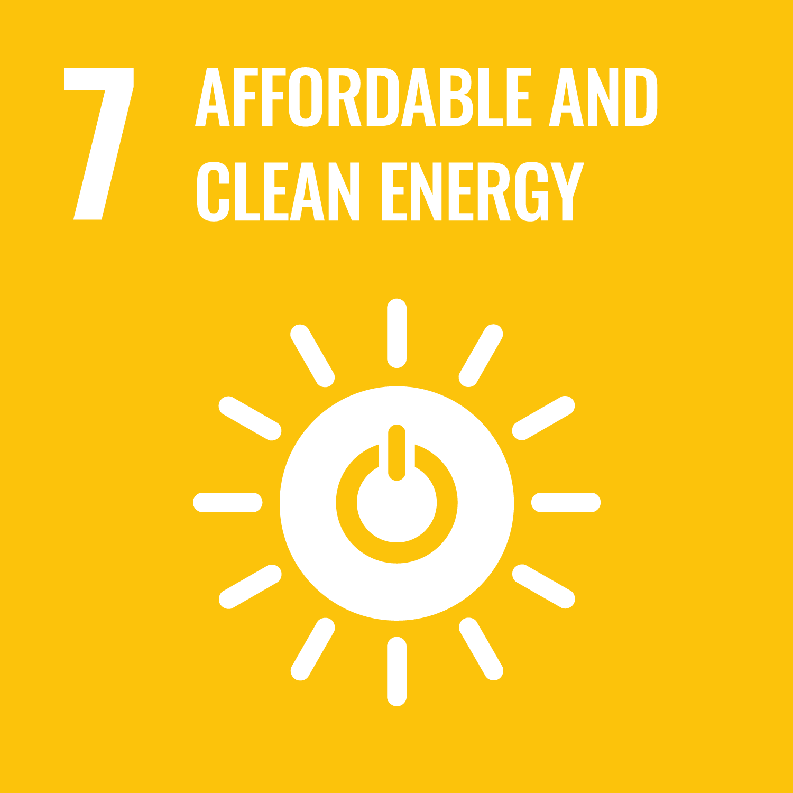

---
# Page metadata
layout: clews
title: "CLEWS"
permalink: "/clews/"
description: "CLEWS integrates Climate, Land, Energy and Water systems to support sustainable development strategies."
header_transparent: false
header_color_mode: dark
meta_title: "CLEWS – United Nations Modelling Tool"

# Hero banner shown at top of page
hero:
  enabled: true
  heading: "CLEWS"
  sub_heading: "A powerful framework for integrated resource planning, helping governments align strategies with sustainability goals"
  text_color: "#FFFFFF"
  background_color: ""
  background_gradient: false
  background_image: "/assets/images/gen/home/CLEWs_V2.png"
  fullscreen_mobile: true
  fullscreen_desktop: false
  height: "750px"

# Introductory section with explainer text + video + interactions image
intro:
  enabled: true
  align: left
  heading: "Understanding CLEWs"
  sub_heading: |
    At the most basic level, a country only needs 3 things: water, food, and energy. **Land**, energy and water to produce food; **energy** for households & industry; and **water** for drinking & industrial processes. While those 3 resources are not infinite, demand for them is ever increasing due to population growth and economic development, and the impacts of climate change further compound this challenge — hence the need for an integrated analysis of the Climate, Land, Energy, and Water systems (CLEWs) to avoid unintended cross-sectoral impacts and identify co-benefit opportunities.

    For example, altered rainfall patterns can reduce water availability for hydropower generation and agriculture in your country. To maintain agricultural production, you will then need to pump groundwater for irrigation, which requires more electricity. To meet this new electricity demand, and given that your hydropower capacity has also been reduced, you will need more energy from fossil fuel power plants. Thus, you will face increased dependency on international fuel imports, exposing your country to shock prices and impacting your national budget, while also increasing your country’s GHG emissions.
  sub_heading_video_url: "https://www.youtube.com/embed/9Kg_mXQMSt0"
  sub_heading_video_title: "YouTube Video"
  sub_heading_after: |
    CLEWs is a framework designed to map the interactions between different land uses (e.g., agriculture, forests, cities), energy systems (e.g., coal power plants, dams, solar panels), and water resources (e.g., rain, rivers, and aquifers) under different climate change scenarios (e.g., reduced rain, increased temperatures). By analysing these interactions, CLEWs can identify opportunities for synergies, highlight trade-offs, and offer options.
  sub_heading_image: "/assets/images/gen/home/CLEWs_interactions.png"

# Purpose section (4 purposes rendered via icon list styles)
purpose:
  enabled: true
  band_class: "white"
  align: left
  heading: "CLEWs Purpose"
  # Markdown icon list replacing the plain numbered list for visual clarity.
  sub_heading: |
        The end goal of a CLEWs assessment is to inform policy design and planning processes, with roughly 4 main purposes:

        - {: .clews-purpose-icon }

          **Policy coherence:** understand how policies interact and affect resource use, so decision-makers can identify synergies, trade-offs, and risks early. For example: What are the cross-cutting implications of our NDCs? Do we have enough natural resources to attain simultaneously food security, water security, and energy security? Are our different national policies compatible or what are their trade-offs?

        - {: .clews-purpose-icon }

          **Green transition:** identify the technology deployment needed to achieve policy goals. For example: What is the least-cost pathway to achieve our renewable energy targets? How can technological solutions reduce water losses? How can technology help us increase crop yields?

        - {: .clews-purpose-icon }

          **Resource management:** explore options to improve resource efficiency. For example: Can we reduce electricity requirements by improving water efficiency? Can household energy efficiency reduce water requirements in electricity generation?

        - {: .clews-purpose-icon }

          **Climate change impacts:** analyze the impacts of climate change over different systems. For example: Which adaptation options would be most beneficial to my country? How can we achieve GHG mitigation to comply with the Paris Agreement? Which are the least-cost pathways to attain decarbonization?
        {: .clews-purpose-list }
  sub_heading_video_url: "https://player.vimeo.com/video/1086915730?h=0331661007"
  sub_heading_video_title: "Vimeo Video"

# Implementation section (5 phases rendered via icon list styles)
implementation:
  enabled: true
  band_class: "white"
  align: left
  heading: "CLEWs Implementation"
  # Markdown cards replacing the old table; all phase details are preserved.
  sub_heading: |
        To implement the CLEWs framework, there are typically 5 phases:
        - {: .clews-phase-icon }

          **1. Systems Profiling**

          Understand the characteristics of each CLEW system in the country and how it's being used (e.g., development trends, policies, or availability of resources) and set up the study boundaries (what will be included or not).

          **Activities:** Literature review to identify the current state and historical & future trends; review sectoral policies & strategies; identifiy & discuss with stakeholders.

        - {: .clews-phase-icon }

          **2. Pre-nexus Assessment**

          Map CLEW systems interactions between and within sectors.

          **Activities:** Evaluate sectoral goals; map interactions through a diagram; identify nexus issues.

        - {: .clews-phase-icon }

          **3. Model Development**

          Tailor the model to the country based on data availability, duration of the assessment, and policy objectives.

          **Activities:** Develop scenarios; prepare data; select & link models; undertake participatory workshops.

        - {: .clews-phase-icon }

          **4. Analysis of Results**

          Analyze results and, if needed, refine the model and perform additional model runs.

          **Activities:** Visualize & analyze results; revise assumptions & inputs; perform additional model runs; select & prepare indicators for scenario comparison; summarize emerging trends, trade-offs, and opportunities.

        - {: .clews-phase-icon }

          **5. Recommendations**

          Provide policy recommendations based on the key findings, highlighting trade-offs, synergies, and opportunities.

          **Activities:** Identify solutions & policy recommendations; draft policy briefs, technical reports, presentations, and scientific publications; disseminate briefs.
        {: .clews-phase-list }
  sub_heading_after: |
        If you're interested in learning more about CLEWS, take a look at our free, on-line course:
        {: .clews-course-note }
  buttons:
    enabled: true
    list:
      - text: "CLEWs Course"
        url: "https://capacity.desa.un.org/article/introduction-clews"
        external: false
        size: large
        style: "primary"

# Countries section used by the custom countries renderer in `clews.html`
countries:
  enabled: true
  align: center
  heading: "CLEWS and the UN"
  sub_heading: "Take a look at the CLEWs work the UN has done around the globe:"
  continents:
    - name: Africa
      flags:
        - name: Ethiopia
          url: "/country-projects/ethiopia/"
          flag: "/assets/images/flags/ethiopia.svg"
          external: false
        - name: Ghana
          url: "/country-projects/ghana/"
          flag: "/assets/images/flags/ghana.svg"
          external: false
        - name: Mauritius
          url: "/country-projects/mauritius/"
          flag: "/assets/images/flags/mauritius.svg"
          external: false
        - name: Namibia
          url: "/country-projects/namibia/"
          flag: "/assets/images/flags/namibia.svg"
          external: false
        - name: Uganda
          url: "/country-projects/uganda/"
          flag: "/assets/images/flags/uganda.svg"
          external: false
        - name: Zambia
          url: "/country-projects/zambia/"
          flag: "/assets/images/flags/zambia.svg"
          external: false
    - name: America
      flags:
        - name: Bolivia
          url: "/country-projects/bolivia/"
          flag: "/assets/images/flags/bolivia.svg"
          external: false
        - name: Costa Rica
          url: "/country-projects/costa-rica/"
          flag: "/assets/images/flags/costa-rica.svg"
          external: false
        - name: Dominican Republic
          url: "/country-projects/dominican-republic/"
          flag: "/assets/images/flags/dominican-republic.svg"
          external: false
        - name: Mexico
          url: "/country-projects/mexico/"
          flag: "/assets/images/flags/mexico.svg"
          external: false
        - name: Paraguay
          url: "/country-projects/paraguay/"
          flag: "/assets/images/flags/paraguay.svg"
          external: false
    - name: Asia
      flags:
        - name: Bhutan
          url: "/country-projects/bhutan/"
          flag: "/assets/images/flags/bhutan.svg"
          external: false
        - name: Indonesia
          url: "/country-projects/indonesia/"
          flag: "/assets/images/flags/indonesia.svg"
          external: false
        - name: Lao PDR
          url: "/country-projects/lao-pdr/"
          flag: "/assets/images/flags/lao-pdr.png"
          external: false
        - name: Philippines
          url: "/country-projects/philippines/"
          flag: "/assets/images/flags/philippines.svg"
          external: false
        - name: Viet Nam
          url: "/country-projects/vietnam/"
          flag: "/assets/images/flags/vietnam.svg"
          external: false

# Case-study + references section based on Ramos et al. (2020)
action:
  enabled: true
  band_class: "grey"
  align: left
  heading: "CLEWs in Action"
  sub_heading: |
        Since its inception circa 2012, CLEWs has been used not only by UN DESA but by many others around the world:

        | Geographical scope | Case study | Period | Description | References |
        | --- | --- | --- | --- | --- |
        | Local | CCT, South Africa | 2015 | A bespoke model used to evaluate the implications of future urban development pathways for the city. | [[1]][1], [[2]][2] |
        | Local | Cape Town, South Africa | 2024 | System-dynamics evaluation of resilience policies in the water-food nexus. | [[3]][3] |
        | Local | Favignana Island, Italy | 2023 | Hourly OSeMOSYS model for coupled long-term energy and water planning. | [[4]][4] |
        | Local | NYC, USA | 2017 | A model developed to investigate and rank adaptation and mitigation interventions under social, political and environmental constraints. | [[5]][5], [[6]][6] |
        | Local | Oskarshamn, Sweden | 2019 | An integrated modelling framework developed to assess the impact of urban interventions as adopted from city strategic planning. | [[7]][7] |
        | National | Bolivia | 2020 | A model developed to investigate scenarios on climate change adaptation interventions in the electricity sector and implications for water security and poverty. | [[8]][8] |
        | National | Burkina Faso | 2012 | A model developed to identify potential sectors for development and design the least-cost pathway for universal access to modern energy services. | [[9]][9] |
        | National | Canada | 2022 | Applies open-source CLEWs to examine biofuel and decarbonization pathways. | [[10]][10] |
        | National | Costa Rica | 2024 | Integrated CLEWs framework to inform NDC updating and policy scenario analysis. | [[11]][11] |
        | National | Costa Rica | 2022 | Identifies cross-sector policy synergies for decarbonization and SLCP mitigation. | [[12]][12] |
        | National | Costa Rica | 2020 | A model developed to estimate implications of national adaptation and decarbonization interventions in the agricultural and energy sectors. | [[13]][13] |
        | National | Ethiopia | 2019 | A model developed to investigate the conditions under which adaptation and mitigation interventions can reduce regional disparities while achieving policy goals. | [[14]][14] |
        | National | Lebanon | 2020 | Multi-attribute assessment of electricity supply options in a FEW-nexus context. | [[15]][15] |
        | National | Mauritius I | 2013 | A model developed to compare low-carbon strategy development options as specified in the nationally determined contributions. | [[16]][16], [[17]][17], [[18]][18], [[19]][19] |
        | National | Mauritius II | 2017 | A model designed to identify low-carbon transition pathways and facilitate public policy action to improve energy and food security. | [[20]][20], [[21]][21], [[22]][22] |
        | National | Mauritius III | 2017 | A model designed to investigate the impact of electric vehicle fleet as specified in the national strategy for an integrated electric mobility framework. | [[23]][23] |
        | National | Nicaragua | 2018 | A model developed to identify measures that increase agricultural productivity and profitability under uncertain climate and market conditions. | [[24]][24], [[25]][25] |
        | National | Sierra Leone | 2019 | A model used to identify the impact of adaptation and mitigation interventions and determine implementation costs and the distribution of those costs among responsible stakeholders. | [[26]][26] |
        | National | South Africa | 2021 | Industry 4.0-focused CLEWs chapter on climate-resilient waste-to-energy transitions. | [[27]][27] |
        | National | Uganda | 2023 | Analyzes hydropower resilience and adaptation options under extreme climate variability. | [[28]][28] |
        | National | Uganda | 2020 | Quantifies cross-system effects of energy, land, and water decisions on emissions and food production. | [[29]][29] |
        | National | Uganda | 2019 | A model developed to investigate interventions that align Uganda Vision 2040 and Nationally Determined Contributions with the Sustainable Development Goals. | [[30]][30], [[31]][31], [[32]][32] |
        | National | United Kingdom | 2023 | Pedagogical CLEWs modelling approach to teach nexus thinking for wicked problems. | [[33]][33] |
        | National | Viet Nam | 2021 | Hierarchical-clustering method to improve spatial representation in WEF models. | [[34]][34] |
        | Regional | Africa | 2024 | Assesses robustness of climate-change patterns for solar PV and wind planning. | [[35]][35] |
        | Regional | Africa | 2022 | Evaluates mitigation pathways and water-footprint implications across Africa’s energy system. | [[36]][36] |
        | Regional | Africa | 2019 | A model used to identify areas where interventions can improve climate resilience of resource systems while reducing greenhouse gas emissions. | [[37]][37], [[38]][38] |
        | Regional | Alazani/Ganykh | 2017 | A model developed to identify policy interventions that can maximise transboundary cooperation while reducing trade-offs among sectors. | [[39]][39], [[40]][40], [[41]][41] |
        | Regional | Basilicata Region, Italy | 2024 | TIMES Land-WEF model used to assess Farm to Fork policy impacts on agriculture. | [[42]][42] |
        | Regional | British Columbia, Canada | 2024 | Assesses land-system implications of electrification pathways using a nexus model. | [[43]][43] |
        | Regional | Buffalo River Catchment, South Africa | 2024 | Models water supply-demand dynamics under climate change scenarios. | [[44]][44] |
        | Regional | Buffalo River Catchment, South Africa | 2023 | WEAP-based assessment of climate-change impacts on surface-water availability. | [[45]][45] |
        | Regional | Buffalo River Catchment, South Africa | 2023 | Uses WEF nexus modelling to test adaptation strategies under climate change. | [[46]][46] |
        | Regional | China | 2024 | Explores WEF-based development pathways for mega-large urban agglomerations. | [[47]][47] |
        | Regional | Drin Basin (Southeast Europe) | 2023 | Integrated water-energy modelling of hydropower under climate-change conditions. | [[48]][48] |
        | Regional | Drina River Basin | 2017 | A model developed to identify policy interventions that can maximise transboundary cooperation while reducing trade-offs among sectors. | [[49]][49], [[50]][50], [[51]][51] |
        | Regional | FAO NENA Jordan | 2019 | A model applied to investigate the climate and socioeconomic dimensions of food waste and support climate policy and adaptation. | [[52]][52] |
        | Regional | FAO NENA Morocco | 2019 | A model applied to investigate the climate and socioeconomic dimensions of food waste and support climate policy and adaptation. | [[53]][53], [[54]][54] |
        | Regional | GLUCOSE | 2020 | A model developed to investigate and compare integrated responses to climate risks under uncertainty and at multiple spatial scales. | [[55]][55], [[56]][56], [[57]][57] |
        | Regional | LAC | 2020 | A model developed to assess the impact of uncertain climate conditions and identify interventions to improve adaptation and mitigation planning. | [[58]][58] |
        | Regional | Northwestern Sahara Aquifer System (NWSAS) | 2020 | GIS-based CLEWs approach for agriculture-water-energy planning. | [[59]][59] |
        | Regional | NWSAS | 2018 | A model used to identify policy options that can maximise transboundary cooperation while reducing trade-offs among sectors and preserving groundwater resources. | [[60]][60], [[61]][61], [[62]][62], [[63]][63] |
        | Regional | Sava | 2017 | A model developed to identify policy interventions that can maximise transboundary cooperation while reducing trade-offs among sectors. | [[64]][64], [[65]][65], [[66]][66], [[67]][67] |
        | Regional | Souss-Massa Basin, Morocco | 2022 | Participatory agriculture-water-energy nexus analysis for robust decision-making under water scarcity. | [[68]][68] |
        | Regional | Syr Darya | 2017 | A model developed to identify policy interventions that can maximise transboundary cooperation while reducing trade-offs among sectors. | [[69]][69], [[70]][70], [[71]][71], [[72]][72] |
        | Regional | Upper White Nile Basin, East Africa | 2024 | Stakeholder-defined WEFE indicators to capture local nexus trade-offs. | [[73]][73] |
        | Global | Global | 2024 | Assesses how near-term nexus-SDG action affects long-term climate outcomes. | [[74]][74] |
        | Global | Global | 2021 | Introduces GLUCOSE, a least-cost open-source global CLEWs exploratory model. | [[75]][75] |

        *Note: Data in this table were extracted from Ramos et al. (2021) [[76]][76] and Alexander et al. (2025) [[77]][77].*
        {: .clews-table-source-note }

        [1]: https://duckduckgo.com/?q=Climate+Land+Energy+and+Water+Strategies+in+the+city+of+Cape+Town
        [2]: https://doi.org/10.17159/2413-3051/2014/v25i4a2239
        [3]: https://doi.org/10.1186/s42269-024-01255-6
        [4]: https://doi.org/10.1016/j.enconman.2022.116541
        [5]: https://doi.org/10.1016/j.scs.2017.02.007
        [6]: https://doi.org/10.1002/ldr.3113
        [7]: https://doi.org/10.3390/su11071847
        [8]: https://doi.org/10.21203/rs.3.rs-97263/v2
        [9]: https://doi.org/10.1111/j.1477-8947.2012.01463.x
        [10]: https://doi.org/10.1016/j.esr.2022.100929
        [11]: https://doi.org/10.1016/j.esr.2024.101316
        [12]: https://doi.org/10.1016/j.jclepro.2022.134781
        [13]: https://duckduckgo.com/?q=Development+and+Assessment+of+Decarbonization+Pathways+Costa+Rica+NDC+Modeling+Tool+and+Analysis+Final+Version
        [14]: https://archive.uneca.org/sites/default/files/uploaded-documents/ACPC/CLEWs-Ethiopia-2019/agenda_and_concept_note_-_clews_ethiopia_workshop_-_17_jan_2019.pdf
        [15]: https://doi.org/10.1007/978-3-030-40052-1_1
        [16]: https://doi.org/10.1038/nclimate1789
        [17]: https://core.ac.uk/display/44737026?source=2&algorithmId=14&similarToDoc=52953949&similarToDocKey=CORE&recSetID=39207be8-68ba-417b-97bb-397abf07e2db&position=1&recommendation_type=same_repo&otherRecs=44737026,52948018,52951228,6373206,33898137
        [18]: https://doi.org/10.1016/j.apenergy.2013.08.083
        [19]: https://www.academia.edu/26583887/Seeking_CLEWS_Climate_Land_Energy_and_Water_Strategies_A_pilot_case_study_in_Mauritius?auto=download
        [20]: https://un-modelling.github.io/clews-mauritius-presentation/
        [21]: https://un-modelling.github.io/about/
        [22]: https://meetingorganizer.copernicus.org/EGU2016/EGU2016-15765.pdf
        [23]: https://doi.org/10.1016/j.egypro.2017.03.714
        [24]: https://duckduckgo.com/?q=Modelling+of+Nicaragua+power+sector+towards+a+CLEWs+nexus+assessment
        [25]: https://meetingorganizer.copernicus.org/EGU2017/EGU2017-14454.pdf
        [26]: https://archive.uneca.org/sites/default/files/uploaded-documents/ACPC/annex_18_-_egm_report_-_climate_land_energy_and_water_strategies_clews_to_support_the_implementation_of_ndcs.pdf
        [27]: https://doi.org/10.1007/978-3-030-45106-6_69
        [28]: https://doi.org/10.3390/cli11090177
        [29]: https://doi.org/10.1088/2515-7620/abaf38
        [30]: http://urn.kb.se/resolve?urn=urn:nbn:se:kth:diva-271700
        [31]: https://doi.org/10.3390/w11091805
        [32]: https://doi.org/10.1007/978-3-319-71025-9_45-2
        [33]: https://doi.org/10.3390/en16145539
        [34]: https://doi.org/10.1088/1748-9326/ac2ce9
        [35]: https://doi.org/10.1088/2515-7620/ad17d4
        [36]: https://doi.org/10.1088/1748-9326/ac5ede
        [37]: https://doi.org/10.1596/978-1-4648-0466-3
        [38]: https://doi.org/10.1038/s41467-018-08275-7
        [39]: https://unece.org/fileadmin/DAM/env/water/publications/WAT_Nexus/ece_mp.wat_46_eng.pdf
        [40]: https://unece.org/fileadmin/DAM/env/water/meetings/Climate_Change/2017/9thTF_Water_and_Climate/Policy-Brief-Alazani-WEB.pdf
        [41]: https://unece.org/env/water/nexus
        [42]: https://doi.org/10.1016/j.nexus.2024.100315
        [43]: https://doi.org/10.1016/j.rset.2024.100080
        [44]: https://doi.org/10.1371/journal.pclm.0000464
        [45]: https://doi.org/10.1016/j.ejrh.2023.101330
        [46]: https://doi.org/10.2166/wcc.2023.263
        [47]: https://doi.org/10.1016/j.jclepro.2024.143481
        [48]: https://doi.org/10.1016/j.esr.2023.101098
        [49]: https://unece.org/env/water/nexus
        [50]: https://doi.org/10.5278/ijsepm.2018.18.2
        [51]: https://unece.org/environmental-policy/conventions/water/envwaterpublicationspub/envwaterpublicationspub74/2017/assessment-of-the-water-food-energy-ecosystem-nexus-and-benefits-of-transboundary-cooperation-in-the-drina-river-basin/doc.html
        [52]: https://doi.org/10.1007/s43621-022-00091-w
        [53]: https://doi.org/10.1016/j.esd.2022.08.009
        [54]: https://www.energy.kth.se/energy-systems/current-projects/fao-implementing-the-2030-agenda-for-water-efficiency-productivity-and-water-sustainability-in-nena-countries-1.928819
        [55]: https://meetingorganizer.copernicus.org/EGU2016/EGU2016-15771.pdf
        [56]: https://www.diva-portal.org/smash/get/diva2%3A656757/fulltext01.pdf
        [57]: https://sustainabledevelopment.un.org/index.php?page=view&type=400&nr=1454&menu=35
        [58]: https://doi.org/10.18235/0001650
        [59]: https://doi.org/10.3390/su12177043
        [60]: http://urn.kb.se/resolve?urn=urn:nbn:se:kth:diva-244449
        [61]: https://unece.org/env/water/nexus
        [62]: https://doi.org/10.3390/su12177043
        [63]: https://unece.org/fileadmin/DAM/env/water/publications/WAT_NONE_16_NWSAS_Nexus/NWSAS-UNECE_EN_Web.pdf
        [64]: https://unece.org/fileadmin/DAM/env/water/publications/WAT_Nexus/ece_mp.wat_46_eng.pdf
        [65]: https://duckduckgo.com/?q=Energy+systems+analysis+of+transboundary+river+basins+in+a+nexus+approach+The+Sava+river+basin+study+case
        [66]: https://unece.org/env/water/nexus
        [67]: https://unece.org/fileadmin/DAM/env/water/publications/GUIDELINES/2017/nexus_in_Sava_River_Basin/Nexus-SavaRiverBasin_ECE-MP.WAT-NONE-3_WEB_final_corrected_for_gDoc.pdf
        [68]: https://doi.org/10.1016/j.esd.2022.08.009
        [69]: https://unece.org/fileadmin/DAM/env/water/publications/WAT_Nexus/ece_mp.wat_46_eng.pdf
        [70]: https://unece.org/env/water/nexus
        [71]: https://doi.org/10.1504/IJESD.2021.112667
        [72]: https://unece.org/index.php?id=45042
        [73]: https://doi.org/10.1016/j.scitotenv.2024.172839
        [74]: https://doi.org/10.1088/1748-9326/ad3973
        [75]: https://doi.org/10.1016/j.envsoft.2021.105091
        [76]: https://doi.org/10.1088/1748-9326/abd34f
        [77]: https://doi.org/10.1088/2752-5295/adf504

# SDG section (markdown list rendered as styled cards in Sass)
sdgs:
  enabled: true
  band_class: "grey"
  align: left
  heading: "CLEWs and the SDGs"
  # Use markdown-only content here to keep this page clean and consistent.
  sub_heading: |
        CLEWs can directly support the achievement of several SDGs:
        - {: .clews-sdg-icon }

          **End hunger, achieve food security and improved nutrition, and promote sustainable agriculture**

          CLEWs can model various scenarios on food production and agriculture, such as increased irrigated crops for higher yield, and study how sustainable they are in the long-term under different climate change conditions.

        - {: .clews-sdg-icon }

          **Ensure availability and sustainable management of water and sanitation for all**

          CLEWs can represent the water cycle and how water security is impacted by new requirements, such as increased energy demand and changed rainfall patterns.

        - {: .clews-sdg-icon }

          **Ensure access to affordable, reliable, and modern energy for all**

          CLEWs can assess renewable energy pathways, such as increased energy production from wind and solar power, and study the investment requirements and how they impact GHG emissions.

        - {: .clews-sdg-icon }

          **Take urgent action to combat climate change and its impacts**

          SDGs 2, 6, and 7 must be achieved for SDG 13 to succeed. CLEWs can assess the interlinkages among those goals to ensure an adequate enabling environment to achieve SDG 13.
        {: .clews-sdg-list }

---
